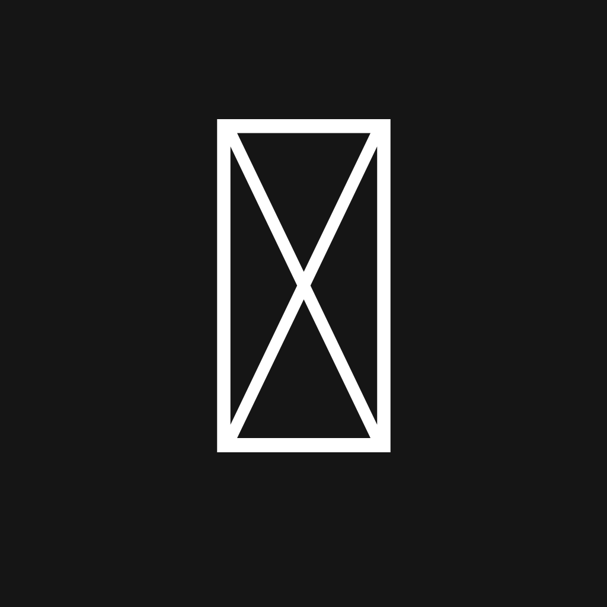
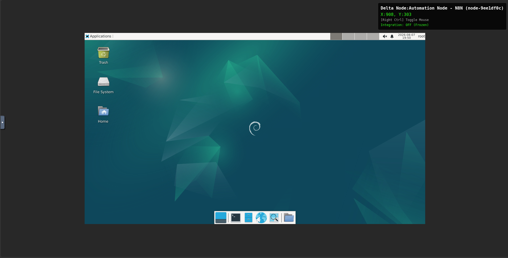
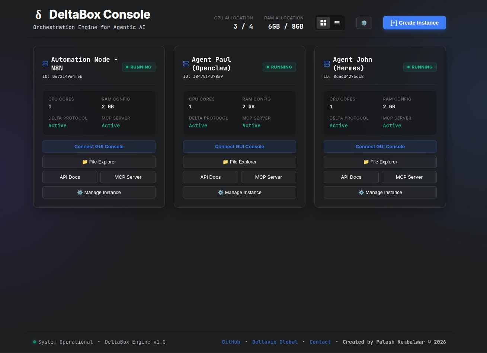
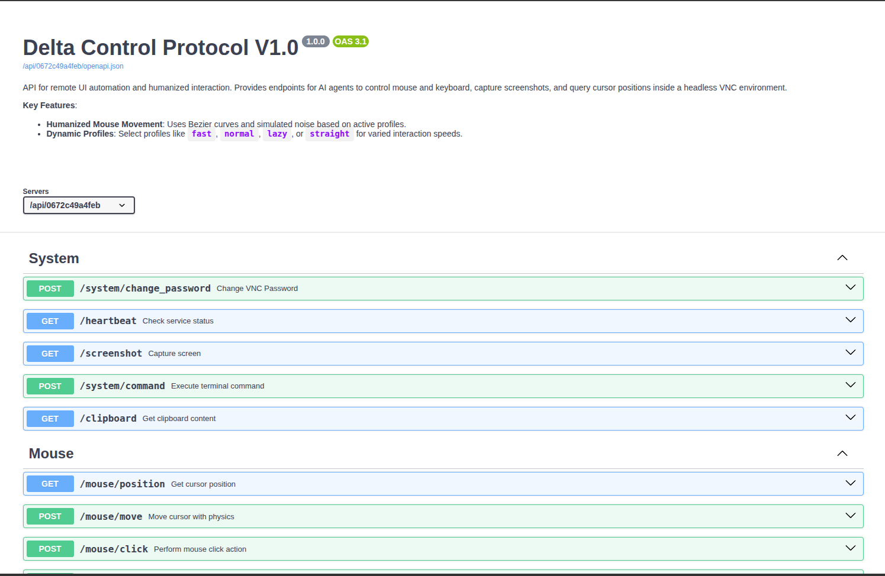

# DeltaBox

<div align="center">

  <h3>Orchestration Engine for Agentic AI</h3>
  <p>A self-hosted, highly scalable graphical environment orchestration platform designed specifically to give AI Agents a "Body".</p>
  
  <p>
    <a href="#overview">Overview</a> •
    <a href="#the-problem--the-solution">The Solution</a> •
    <a href="#core-offerings">Offerings</a> •
    <a href="#architecture">Architecture</a> •
    <a href="#installation">Installation</a> •
    <a href="#delta-control-protocol">API</a> 
  </p>

</div>


---

## 🚀 Overview

Large Language Models (LLMs) and Agentic AI have evolved to act as intelligent "Brains", capable of complex reasoning and task planning. However, they lack a dedicated "Body" to execute graphical, real-world interactions.

**DeltaBox** bridges this gap by providing **Full Computer Automation**. It is an enterprise-grade orchestration engine that instantly spins up isolated, containerized Linux desktop environments. Whether you are running highly intelligent, autonomous agents or simple, rule-based "dumb" bots, DeltaBox gives them a complete sandbox to operate in. Through the native **Delta Control Protocol** and **Model Context Protocol (MCP)**, your AI agents can visually perceive the entire screen using OS-level Accessibility Trees (AT-SPI2) and physically interact with *any* application—from web browsers to desktop terminals—using human-like mouse and keyboard movements.

## 🧠 The Problem & The Solution

**The Problem:** Modern AI agents are computationally brilliant but physically constrained. When engineers attempt to give AI access to software, they are forced to build rigid, application-specific API integrations or rely on brittle, DOM-based web automation frameworks. These methods fail when target software lacks an API, changes its underlying code structure, or deploys anti-automation defenses.

**The Solution: Sandboxed Computer Automation.** DeltaBox provides a true **Visual Sandbox for the entire Operating System**. Your AI agent "sees" exactly what a human sees (via highly token-optimized AT-SPI2 semantic trees across the entire desktop) and clicks exactly where a human would click (via coordinate-based API commands mapped to X11). Because the interaction happens at the OS level, it is completely agnostic to the underlying application's code, perfectly modeling true human-computer interaction without ever touching the DOM or application source.

## 🎯 Domain Use Cases

DeltaBox's OS-level agnostic approach makes it the ultimate engine for diverse automation workloads:

*   **Agentic AI "Bodies"**: Provide a safe, isolated sandbox for autonomous agents (like OpenClaw, Hermes, ClaudeCode, AutoGPT) to browse the web, write code, or execute complex desktop workflows without compromising your host machine.
*   **Non-API Solutions (Legacy Automation)**: Automate interactions with legacy desktop software or proprietary ERP systems that completely lack modern APIs. If a human can see and click it on a screen, your AI can automate it.
*   **Synthetic Data Generation**: Automate desktop environments at scale to generate massive datasets of visual interactions, screenshots, and UI state-changes to train new Vision-Language Models (VLMs) and foundation models.
*   **Next-Gen RPA Modernization**: Upgrade brittle, expensive Robotic Process Automation (RPA) pipelines with resilient AI models that visually interpret the screen, eliminating the need for hardcoded selectors.
*   **Security & Malware Sandboxing**: Safely execute and monitor untrusted, AI-generated code or complex web scripts within completely disposable, hardware-isolated Linux environments.
*   **Massive Parallel Workflows**: Spin up 100+ isolated graphical containers simultaneously to execute complex, distributed autonomous research or cross-application tasks.

## ✨ Core Offerings

DeltaBox is built for massive scale, precision, and agentic autonomy.

### 1. Unmatched Token Efficiency (Context Optimization)
For an LLM to accurately interact with a complex GUI, it needs context. DeltaBox extracts the raw OS-level Accessibility Tree and mathematically optimizes it (removing off-screen items, deduplicating React render artifacts, and stripping useless metadata) before sending it to the agent. This provides a massive reduction in context window usage and latency.

| Extraction Method | Avg. Token Consumption | Context Quality for Agent | Hallucination Risk |
| :--- | :--- | :--- | :--- |
| **Raw HTML DOM** | 40,000 - 150,000+ | Very Low (Cluttered with CSS/SVGs/Scripts) | High |
| **Standard UI-Tree (A11y)** | 8,000 - 20,000 | Medium (Includes hidden & off-screen elements) | Medium |
| **Vision / Screenshot** | 1,100 - 1,500+ | Low (Lacks discrete element IDs and layout structure) | Very High |
| **Delta Protocol (Optimized)** | **~300 - 1,200** | **Perfect (Only mathematically visible, actionable nodes)** | **Near Zero** |

### 2. Humanized Biomechanical Interaction
DeltaBox does not instantly teleport the mouse. The **Delta Control Protocol** includes built-in physics engines that simulate human interaction:



*   **Bezier Curve Mouse Movements**: Complex mathematical curves simulate natural hand movements to target coordinates.
*   **Micro-Tremor Injection**: Injects localized noise simulating human hand jitter.
*   **Natural Typing Cadence**: Keyboard commands simulate human typing delays and errors.

### 3. Elastic Swarm Orchestration
Manage your agent infrastructure dynamically. The Swarm Manager allows you to programmatically spin up 10, 50, or 100 isolated GUI containers on-demand, execute parallel agentic workflows, and tear them down gracefully to free up compute resources.

### 4. Integrated Proxy Management
For heavy autonomous data gathering, IP diversity is critical. DeltaBox offers native proxy integration. When spawning a new node, you can instantly attach sticky or rotating proxies to ensure that every container maintains a unique network fingerprint and origin IP.

### 5. The Cloud Console
While your AI agents operate in the background, you maintain complete oversight. The **DeltaBox Cloud Console** is a premium, web-based dashboard that allows human operators to view live streams of active nodes, interact manually with the environment if an agent gets stuck, and monitor system resources in real-time.



---

## 🏗️ Architecture

DeltaBox is designed with a microservice architecture to ensure stability and isolation:

- **The Swarm Manager (FastAPI)**: The central brain of the infrastructure. It communicates directly with the Docker daemon to allocate resources, deploy containers, and route proxy traffic.
- **Delta Nodes**: The individual execution sandboxes. Each node is a lightweight, headless X11 environment running a complete graphical desktop, an accessibility tree parser (AT-SPI), and the local API receiver.
- **Nginx Reverse Proxy**: Securely routes traffic and serves the real-time Cloud Console dashboard to operators.

---

## 📦 Installation & Setup

### Prerequisites
- Docker Engine (v24.0+)
- Docker Compose
- Extremely Lightweight: The core image consumes only ~400 MB of RAM per node.
- Cross-Platform: Works on **Windows (WSL2)**, **macOS (Apple Silicon & Intel)**, and **Linux**.

### 1. Clone the Repository
```bash
git clone https://github.com/deltavixglobal/deltabox.git
cd deltabox
```

### 2. Configure Environment (Optional)
You can configure the global resource limits for the Swarm Manager in the `compose.yml` file:
```yaml
  swarm-manager:
    environment:
      - POOL_TOTAL_CPUS=4    # Max CPU cores the swarm can utilize
      - POOL_TOTAL_RAM_GB=8  # Max RAM the swarm can allocate
```

### 3. Spin Up the Stack
Initialize the orchestration stack. This builds the Swarm Manager and deploys the Cloud Console.
```bash
docker compose up -d
```

### 4. Access the Platform
Navigate to the Cloud Console to begin deploying Delta Nodes:
```
http://localhost:9090
```

---

## 🔌 Delta Control Protocol (API Reference)

Once a Delta Node is spawned, it exposes the **Delta Control Protocol V1.0**. Your AI Agent uses this API to interact with the environment. 



A full interactive Swagger UI is generated dynamically for every node at `http://localhost:9090/api/<node id>/docs`.

### Core Endpoints

#### Visual Perception
*   `GET /vision/parse_ui`: Extracts the highly-optimized OS-level Accessibility Tree. Supports filtering by `clickable` or `readable` elements to drastically reduce token payload.
*   `GET /system/screenshot`: Returns a high-resolution base64 or binary image of the current desktop state for Multimodal fallback.

#### Action Routing & Mouse Control
*   `POST /action/click_component`: The primary interaction endpoint. Takes a structural `id` from the parsed UI tree, calculates the physical center, and simulates a humanized Bezier curve mouse click. Can automatically return the updated UI tree in the same response.
*   `POST /mouse/move`: Moves the cursor to explicit raw `[x, y]` coordinates using natural Bezier curves and easing profiles.
*   `POST /action/solve_captcha`: A specialized routine that detects Cloudflare/reCAPTCHA challenges and injects a unique hesitation physics profile to bypass biometric behavioral checks.

#### Keyboard Interaction
*   `POST /keyboard/type`: Types strings into the currently focused window with simulated human keystroke delays and natural jitter.
*   `POST /keyboard/hotkey`: Executes complex OS-level multi-key combinations (e.g., `['ctrl', 'c']`, `['alt', 'tab']`).

#### System Control
*   `POST /system/command`: Allows the agent to execute internal bash shell commands, download dependencies, or retrieve system logs from the container.

---

## 🤖 Model Context Protocol (MCP) Support

DeltaBox provides first-class support for the **Model Context Protocol (MCP)**, allowing seamless, zero-config integration with modern agentic IDEs and assistants like Anthropic's **Claude Desktop**.

Instead of writing custom API wrappers, you can connect your agent directly to a DeltaBox node via MCP over SSE (Server-Sent Events). The MCP Server automatically registers all the Delta Protocol endpoints as native, callable tools complete with rich prompt descriptions and strict JSON schemas, allowing the LLM to autonomously explore and interact with the desktop environment.

---

## 💼 Enterprise Swarm Orchestration by Deltavix

This repository provides the local, personal-use version of DeltaBox. 

Are you a CTO, Hedge Fund, or AI Agency trying to scale this to a **500-node headless data extraction swarm** Need custom proxy-rotators, stateful cluster management, and high-frequency bypasses for DataDome/Cloudflare?

Stop wasting thousands of dollars on SaaS APIs that get blocked every week. Own your infrastructure.

**Contact Deltavix for Customization & Enterprise Deployments:**
*   🌐 **Company Website:** [Deltavix Global](https://www.deltavixglobal.com)
*   📧 **Direct Email:** [info@deltavixglobal.com](mailto:info@deltavixglobal.com)
*   🔗 **Connect with the Founder:** [Palash Kumbalwar on LinkedIn](https://www.linkedin.com/in/palashkumbalwar)

---

## 📄 License (Deltavix Free-to-Use Proprietary License)

This software is completely **Free to Use** for personal, research, and commercial purposes (e.g., using it to run your own AI agents, scraping workflows, or automation pipelines).

**However, this is NOT an Open Source Initiative (OSI) license. The following restrictions apply:**
*   **No Redistribution**: You may not distribute, sublicense, rent, lease, or sell the software (or modified versions) to third parties.
*   **No White-labeling**: You may not remove copyright notices, re-brand, rename, or claim authorship of this software.
*   **No Managed Services / SaaS**: You may not offer this software to third parties as a standalone managed service or API where the primary value is access to DeltaBox itself.

Please see the included `LICENSE` file for the complete legal terms.
